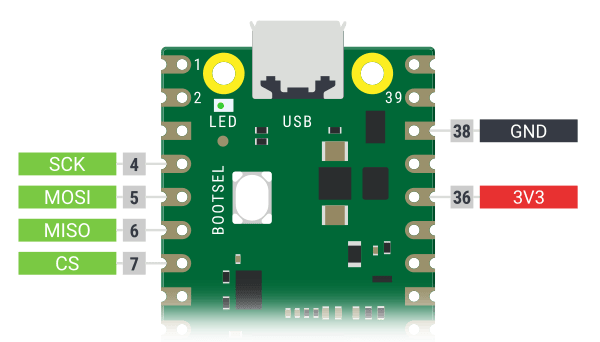

# pico-serprog

Slightly less terrible serprog implementation for the Raspberry Pi Pico and
possibly other RP2040 based boards. Based on pico-serprog by GitHub user
"stacksmashing". Further improved by "kukrimate".

This takes about 17 seconds to read the 8MiB BIOS chip of an X200.

Pinout for the SPI lines:
| Pin | Function |
|-----|----------|
|  7  | CS       |
|  6  | MISO     |
|  5  | MOSI     |
|  4  | SCK      |



## Compiling

```
cmake .
make
```

Plug in your Pico. Mount it as you would any other USB flash drive.
Copy `pico_serprog.uf2` into it. Your programmer is now ready.
If you want to change the firwmare, you need to press the button
on the board while you plug it in.

## Usage

Substitute ttyACMx with the actual tty device corresponding to the firmware.
You can find this by running `dmesg -wH`. When you plug in the device, a line
containing something like this will appear:

```
[453876.669019] cdc_acm 2-1.2:1.0: ttyACM0: USB ACM device
```


Read chip:

```
flashrom -p serprog:dev=/dev/ttyACMx,spispeed=32M -r flash.bin
```

Write chip:
```
flashrom -p serprog:dev=/dev/ttyACMx,spispeed=32M -w flash.bin
```

## License

As a lot of the code itself was heavily inspired/influenced by `stm32-vserprog`
this code is licensed under GPLv3.

pinout.png is based on
[pico-pinout.svg](https://www.raspberrypi.com/documentation/microcontrollers/images/pico-pinout.svg)
by Raspberry Pi Ltd, under the
[Creative Commons Attribution-ShareAlike 4.0 International](https://creativecommons.org/licenses/by-sa/4.0/)
license.

